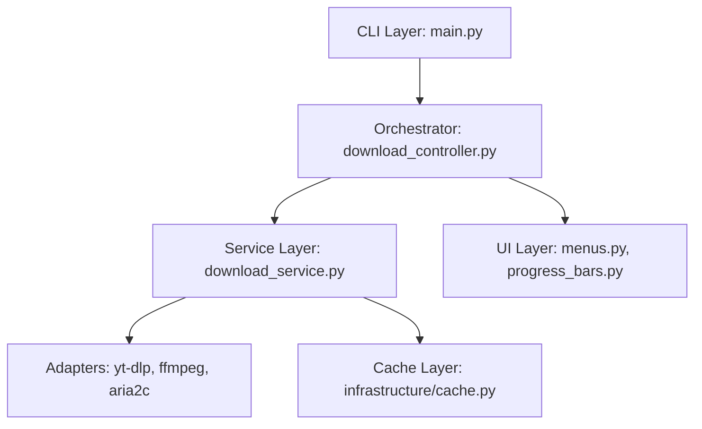

# SOTA Downloader User Guide

Welcome to the SOTA Downloader. This guide provides comprehensive information on using, configuring, and extending the application.

## 1. Introduction
The SOTA Downloader is a modular, terminal-based media extraction tool optimized for Android/Termux environments, utilizing robust async I/O.

## 1.1 Supported Platforms & Policy
SOTA Vid-Dl is designed for optimal performance on mobile-first environments (specifically Termux on Android) and general Linux environments.

**Strict Unsupported Platforms & Browsers:**
- **Apple/macOS:** This project does not support Apple operating systems or devices.
- **Safari Browser:** We do not support the Safari browser.

Attempting installation on these platforms will trigger a critical policy violation warning and terminate the installation process.

## 2. Getting Started
### Prerequisites
- Python 3.13+
- FFmpeg
- Aria2c (recommended for high-speed downloads)

### Installation
```bash
make install
```

## 3. Core Commands
Use the menu to interact with the system:
```bash
make menu
```

| Command | Description |
| :--- | :--- |
| `make run` | Launch the application. |
| `make update` | Upgrade dependencies (handles Termux-specific logic). |
| `make test` | Run the test suite. |
| `make clean` | Purge caches and build artifacts. |
| `make about` | Display system info infographic. |

## 4. Architecture Overview



## 5. System Components
- **Core (`src/sota_dl/core`):** Business logic, models, and service interfaces.
- **Infrastructure (`src/sota_dl/infrastructure`):** Hardware/OS level interaction, adapters for external tools.
- **UI (`src/sota_dl/ui`):** Terminal rendering using `rich`.

## 6. Configuration
Modify `config.yaml` to adjust behaviors like download locations, parallelism, and authentication preferences.

## 7. Typing & Type Safety
- **`py.typed`**: Marker file indicating the package provides inline type annotations for static analysis tools (e.g., `mypy`).
- **`types.py`**: Contains actual Python definitions (Enums, TypeAliases) for domain modeling.

## 8. Security
- Please refer to [`.github/SECURITY.md`](../.github/SECURITY.md) for vulnerability reporting guidelines.
